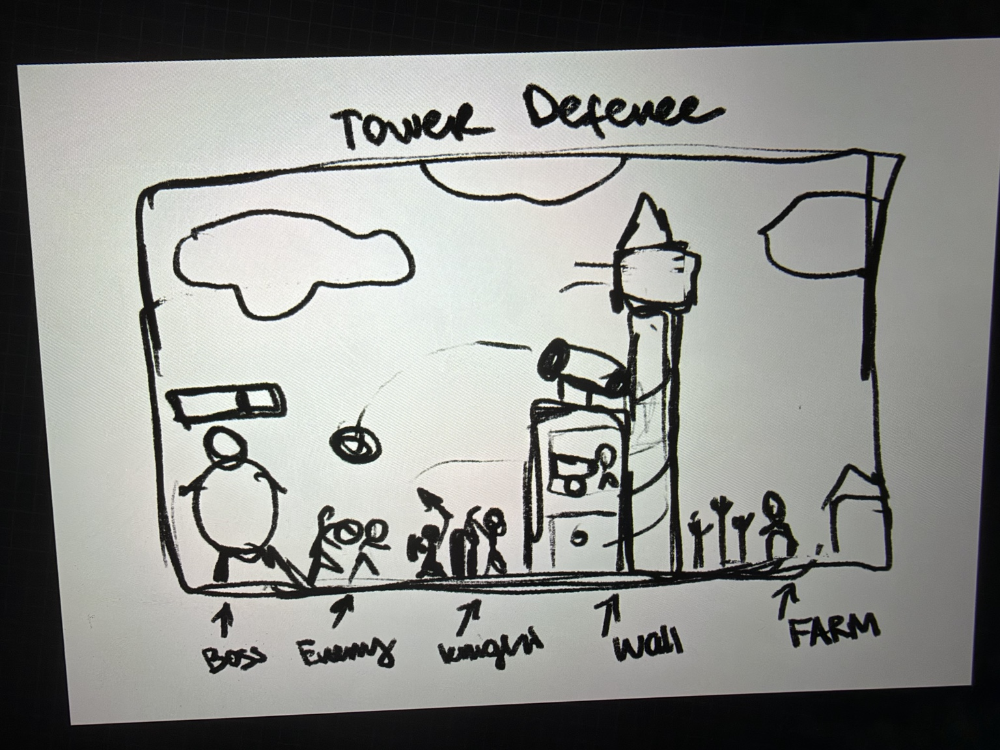
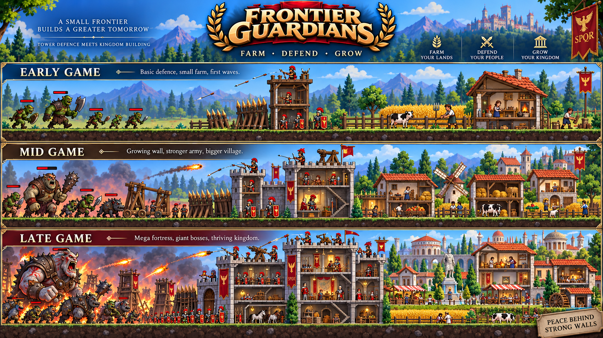

# AFK Rome Village — черновой геймдизайн-документ

**Версия:** 0.1 · 19 сентября 2026  
**Статус:** концепция в обсуждении; создан браузерный прототип основного цикла.  
**Рабочее название:** AFK Rome Village. Frontier Guardians на референсе — ещё один вариант, название не утверждено.

В документе разделены **основа из текущего запроса**, **предложения для обсуждения** и **открытые вопросы**. Числа, состав ресурсов, способности и правила потерь ниже — предварительные варианты, а не готовый баланс.

## 1. Игра в одном абзаце

Игрок развивает небольшую деревню в мире римского фэнтези и защищает её от орд мифических существ. Слева наступают враги, в центре растёт линия обороны, справа живёт и работает поселение. Солдаты сражаются автоматически, жители производят ресурсы, а игрок собирает доход, выбирает улучшения и сам вызывает следующую большую волну. Победы дают средства для развития деревни, деревня обеспечивает усиление обороны, а сильная оборона позволяет побеждать более опасных врагов. Из маленького поселения с несколькими воинами постепенно вырастает крепость с башнями и процветающей деревней за стенами.

**Главное ощущение:** «Я построил это место, вижу, как оно живёт, и делаю его сильнее, чтобы выдержать следующий натиск».

## 2. Основа из текущего запроса

- Жанр: idle / AFK-игра с развитием поселения, автоматической обороной и элементами кликера.
- Мир: римские воины, фермы и храмы против орков и других фантастических существ. Степень исторической точности пока не задана.
- Направление атаки: **слева направо**. Деревня расположена за обороной, справа.
- Подача: объёмная картинка при преимущественно боковом виде, с лёгким взглядом сверху и открытыми интерьерами в духе читаемости Fallout Shelter.
- Игрок строит и улучшает воинов, укрепления и хозяйственные здания.
- Оборона действует сама; следующую большую волну игрок вызывает осознанно.
- Успешная волна продвигает игрока дальше. Поражение должно иметь последствия, но точный откат ещё предстоит определить.
- Развитие должно быть видно на сцене: новые бойцы, деревянные укрепления, камень, более крупные башни, крепость.
- Телефон и компьютер рассматриваются как целевые устройства; приоритет и ориентация телефона пока не выбраны.

**Пока только идеи:** управляемые способности героев, количество героев, ограничения между волнами и ускорение через рекламу.

## 3. Экран и визуальный стиль

```text
                      движение врагов →

[ Орды и боссы ] → [ Воины / преграды ] [ Лучники / башни / крепость ] [ Деревня ]
       СЛЕВА                         ЦЕНТР                              СПРАВА
```

Это схема композиции, а не окончательный порядок каждого сооружения. Места для лучников, шипов и передовой нужно будет уточнить вместе с правилами боя.

Бой и мирная жизнь должны оставаться видны одновременно. С одной стороны — давление врагов, с другой — поля, овцы, жители и работающие здания. Центральные укрепления объясняют, почему деревня в безопасности.

**Предлагаемое направление:** стилизованная 2.5D-диорама, крупные силуэты, немного глубины, преимущественно фиксированная камера. Открытые стены позволяют видеть людей и деятельность внутри зданий. Само наличие разреза не означает, что потребуется система управления комнатами, как в Fallout Shelter.

При росте крепости нужно сохранять видимость передовой и деревни. Способ вместить позднюю игру в экран — масштаб камеры, прокрутка или ограничение размеров — пока открыт. Горизонтальная композиция подходит референсам, но не фиксирует ориентацию мобильной версии.

### Визуальные референсы

**Первичный набросок:** расположение босса, врагов, защитников, стены и фермы.



**Концепт роста:** маленькая деревянная оборона → каменный форт → большая крепость; деревня развивается вместе с ней.



Из второго изображения берём общую композицию, контраст и заметный рост. Все изображённые здания, юниты и декоративные элементы не становятся автоматически обязательным содержимым игры.

## 4. Основной игровой цикл

**Деревня производит → игрок усиливает оборону → оборона побеждает → боевые награды развивают деревню.**

Типичный заход:

1. Игрок возвращается и собирает накопленный доход.
2. Выбирает, куда вложиться: в производство, передовую, дальний бой или укрепления.
3. Видит изменения на сцене и оценивает готовность к следующей волне.
4. Нажимает «Вызвать волну».
5. Наблюдает автоматический бой; при наличии героя использует его способности.
6. При победе получает награду и доступ к следующему этапу. При поражении восстанавливается и готовится повторить попытку.

Здесь «камень–ножницы–бумага» понимается прежде всего как **взаимозависимость экономики и боя**. Отдельная система контрюнитов может появиться позже, но сейчас не считается требованием.

Клики нужны для решений, сбора и способностей. Обязательное непрерывное закликивание врагов пока не входит в концепцию.

## 5. Два режима обороны

Это **предлагаемое уточнение** идеи «всё защищается само, а большую волну я вызываю».

| Режим | Что происходит | Что получает игрок |
|---|---|---|
| Фоновая оборона | Небольшие группы врагов атакуют на уже освоенной сложности, защитники действуют автоматически | Повторяемый небольшой доход, ощущение работающей обороны |
| Волна продвижения | Игрок запускает более сильный натиск; некоторые волны могут завершаться боссом | Разовая награда за первое прохождение, новый рубеж развития |

**Предложение для первой версии правил:** фоновая оборона остаётся на последнем пройденном рубеже и не разрушает поселение в отсутствие игрока. Непройденные волны автоматически не запускаются. После поражения новая сложность не становится фоновой.

AFK-доход можно начислять за время отсутствия без покадрового расчёта боёв. Предел накопления, источники такого дохода и необходимость ручного сбора ещё не определены.

Это разделение должно дать игроку две разные причины возвращаться: забрать результат работы поселения и проверить, готов ли он продвинуться дальше.

## 6. Деревня и экономика

Деревня должна реально помогать обороне. Боевые награды, в свою очередь, должны открывать или ускорять её развитие.

**Предлагаемая стартовая модель — три ресурса:**

| Ресурс | Основной источник | Основные траты |
|---|---|---|
| Еда | Ферма, овцы и другие хозяйства | Найм и усиление обычных бойцов |
| Материалы | Хозяйственные постройки; для начала один общий ресурс | Стены, башни, строительство и улучшение производства |
| Монеты | Фоновые стычки и награды за волны | Улучшения деревни и ключевые военные улучшения |

Пример связи: ферма даёт еду → игрок усиливает воинов → проходит волну → получает монеты → улучшает ферму → быстрее готовит следующую оборону.

Чтобы продвижение не сводилось к бесконечному ожиданию монет, **предлагается** открывать новые ступени зданий за пройденные волны. Повторяемый доход помогает догнать текущую сложность, а первая победа открывает новые возможности.

Здания для обсуждения:

- **Ферма и загон:** производство еды, заметное увеличение полей и поголовья.
- **Мастерская или лесопилка:** материалы для строительства.
- **Дома:** увеличение населения или доступного числа работников; отдельная механика населения пока необязательна.
- **Храм:** позднее усиление поселения, обороны или героев. Роль ещё не выбрана.

Камень можно сначала показать как новый внешний вид и ступень построек, не вводя сразу отдельную валюту. Глубокая симуляция жителей пока не нужна: достаточно понятной производственной функции и видимой жизни.

## 7. Оборона и рост поселения

**Пример последовательности открытий, не финальное дерево:**

| Ступень | Оборона | Мирная сторона | Что меняется для игрока |
|---|---|---|---|
| Застава | Несколько пехотинцев со щитами | Маленькая ферма и дом | Первый доход и первые улучшения |
| Деревянная оборона | Лучники, шипы или частокол, небольшая башня | Загон и производство материалов | Появляется выбор между уроном, стойкостью и экономикой |
| Форт | Каменная стена, более высокая башня, сильная пехота | Несколько хозяйств и больше жителей | Требуется развивать несколько частей обороны |
| Крепость | Крупные башни, замок или цитадель, возможные осадные орудия | Храмы и развитое поселение | Большие волны и заметные боссы |

Рабочее название базового бойца — **пехотинец / легионер**. Упомянутые гоплиты пока служат образом воина со щитом и копьём; точную стилистику армии можно выбрать отдельно.

Основные роли:

- **Пехота** удерживает противников перед укреплениями.
- **Лучники** наносят урон из-за передовой или с башен.
- **Шипы и преграды** задерживают или ослабляют наступление.
- **Стены** принимают удар, когда враги прорываются через передовую.
- **Башни** дают дополнительные позиции и возможности дальнего боя.

**Предложение по строительству:** начать с заранее определённых мест. Игрок выбирает, что открыть и улучшить, а свободную расстановку пока оставить открытым вопросом.

Новые башни и сооружения добавляются в оборону; улучшение конкретного здания меняет его существующий облик. Это позволит сочетать ощущение расширения с понятным экраном.

## 8. Враги, волны и участие игрока

Враги движутся слева направо, вступают в бой с защитниками и атакуют укрепления при прорыве. Конечная цель атаки — защищаемое поселение; точный объект, уничтожение которого означает поражение, ещё нужно выбрать.

Предлагаемые роли врагов: слабый массовый боец, быстрый противник, тяжёлый громила и крупный босс. Новая сложность может менять состав волны, а не только здоровье врагов: толпа проверяет общий урон, громила — устойчивость передовой.

Без героя участие игрока уже состоит в выборе улучшений и момента запуска волны. Герой — дополнительный способ влиять на бой.

**Предложение для обсуждения:** начать с одного героя, который атакует автоматически и имеет одну активную способность. Например, «Удержать строй» временно усиливает защиту передовой, а «Залп» наносит урон группе врагов. Для первого героя выбирается одна из этих идей; два-три героя и развитие отряда остаются возможным расширением.

Если герой появится, его способность должна помогать пройти сложный момент. Фоновая оборона не должна требовать постоянных нажатий.

## 9. Победа, поражение и откат

**Зафиксировано по замыслу:** победа в вызванной волне даёт продвижение; поражение связано с откатом и повреждениями.

**Открыто:** что именно теряется. Возможные правила сильно меняют характер игры.

Предлагаемый вариант для обсуждения:

- При победе рубеж считается пройденным; игрок получает награду первого прохождения и новые открытия.
- При поражении рубеж не засчитывается, награда за победу не выдаётся.
- Купленные постоянные улучшения деревни и уже открытые ступени сохраняются.
- Оборона визуально повреждена; восстановление занимает время или требует ограниченного количества обычных ресурсов.
- Фоновая игра возвращается к последнему пройденному рубежу. После восстановления можно повторить попытку.

Пока это предложение, а не согласованный отказ от более жёсткого отката. Перед разработкой нужно точно назвать сохраняемые улучшения, теряемый прогресс и условие повторной попытки. Восстановление не должно создавать ситуацию, когда ресурсов на ремонт нет и получить их невозможно.

## 10. Таймеры и реклама

**Исходная идея пользователя:** следующая волна доступна через 45 минут; добровольный просмотр рекламы сокращает ожидание на 15 минут; три просмотра позволяют убрать ожидание полностью.

Эту схему пока сохраняем как гипотезу. Её главный риск для задуманного цикла: игрок уже подготовил оборону и хочет проверить улучшения, но вместо боя получает ожидание. Также нужно решить, распространяется ли таймер на повторную попытку после поражения.

**Предложение для обсуждения:** сначала проверить интерес к сбору ресурсов, улучшениям и волнам без длительного ожидания. После этого сравнить исходный вариант с добровольной рекламой за ускорение производства или дополнительную награду.

Выбор модели монетизации не сделан. Рекламные интеграции, покупки и точные таймеры сейчас не являются задачей на разработку.

## 11. Что предстоит решить

В первую очередь:

1. **Поражение:** откат всей текущей стадии или сохранение постоянного развития с ремонтом обороны?
2. **Доступ к волне:** когда игрок готов или только после таймера?
3. **Герой:** нужен ли в первой проверке идеи один герой с одной кнопкой?

Перед прототипом также потребуется выбрать ориентацию телефона, степень свободы строительства и глубину экономики. Эти вопросы не мешают согласовать общую концепцию сейчас.

## 12. Текущий прототип и связь с архивом

После первого черновика был создан небольшой браузерный прототип в каталоге [`prototype/`](prototype/). Он проверяет основную петлю: производство еды, постоянные улучшения, пять вызываемых волн, автоматический бой, поражение и повторную попытку, босса и открытие лучника. Инструкция запуска и точный список реализованных механик находятся в [`prototype/README.md`](prototype/README.md).

Прототип остаётся проверкой идеи, а не началом production-разработки: проект движка, backend, сохранение между устройствами и рекламные интеграции пока не создавались.

Архив `Games_Ideas_Codex_Handoff.zip` содержит `README.md`, `GAME_BRIEF.md` и `CODEX_START_PROMPT.md`. Они рассматриваются как материалы предыдущего обсуждения. Их инструкции начать разработку не заменяют текущий запрос.

- Из архива сохранены идеи живой деревни за стенами, наглядного роста и контраста мирной жизни с опасностью.
- Расположение исправлено по текущему описанию и обоим изображениям: **враги слева, деревня справа**.
- UE5, технические классы и план реализации остаются прежними предложениями; выбор технологии сейчас не требуется.
- Демонстрация на 5–8 минут, пять волн и три стадии роста — возможный будущий формат из архива, не утверждённый объём работ.
- Полный сброс текущего уровня из архива не считается согласованным правилом поражения.

Текущая проверка уже включает ферму, пехоту, лучника, ворота, заметные улучшения, несколько волн и повторную попытку после поражения. Следующий шаг — провести короткие игровые сессии и выяснить, хочется ли игрокам возвращаться за ресурсами, усиливать оборону и самостоятельно вызывать следующую волну.


## Prototype progression update - 2026-09-22

Boss victories gate major town unlocks. AFK resources fund upgrades within the
current town tier, but cannot unlock a new tier. No upgrade-coin currency yet.
Town I has one house, guard/farm caps of 5 and spikes capped at 2 after wave 3.
Wave 1 has one orc; wave 2 has two ordinary orcs; wave 3 introduces dual swords.
After beating the wave-5 boss, a free town upgrade grants town II, a second house,
the tower and archer together, and guard/farm/spikes caps of 10/10/4.
The current prototype ends at wave 5; the archer then fights ambient patrols.
Further bosses, town tiers and perks are future content.


## Объединённая версия · 7 октября 2026

Этот раздел фиксирует решения после объединения с Test1.zip и уточнений пользователя;
при расхождении с ранними разделами актуальны правила ниже.

- Начало — один боец (легионер), фермер и открытое поле без дома. Первый дом появляется после босса пятой волны.
- Кампания расширена до десяти волн, в каждой 1–5 врагов; одновременно не больше двух. Боссы приходят отдельно.
- «Залп» оставлен как необязательная разовая покупка за 20 игровых монет после третьей волны. Перезарядка 18 секунд. Поселение не выдаёт эту покупку бесплатно.
- После босса волны 5 игрок бесплатно улучшает поселение II: растёт деревня, появляются башня и выбор специализации её защитника — лучник по одной цели либо катапульта по площади. Менять слот можно бесплатно между волнами.
- Во втором акте добавлены гоблины, стрелки, всадники и шаман. После босса волны 10 открывается поселение III с виллой и мельницей.
- Поражение наступает при гибели легионера; повторы сохраняют прокачку и закреплённую сложность. Каждая попытка начинается с полным HP бесплатно. Вне боя здоровье плавно восстанавливается.
- Сохранены ограничения прокачки по поселению, 1 монета за 3 патрульных, одноразовая награда за волну, иконки ресурсов, спрайт лучника и безопасная симуляция 100×.
- Отдельная шкала ворот не используется. Прорвавшиеся гоблины крадут ресурсы.
- Проверены маршруты прохождения всех десяти волн без покупки заклинания и с покупкой; подробно — в prototype/README.md. Баланс второго акта пока предварительный.
- Полный исходный документ Клода сохранён в docs/references/CLAUDE_GAME_DESIGN.md для дальнейшей работы над его идеями.


## Герои, слоты и ротация · 7 октября 2026

Согласовано с Никитой; числа предварительные.

- **Герой** — боец со своим активным спеллом. **Оборона** (шипы, вышка, стена, каменная башня, обычные стрелки без спелла) растёт на сцене, но не добавляет кнопок.
- **На поле — до 3 героев**, в коллекции — 5–6. Три кнопки спеллов — предел для телефона.
- Открытие по шагам: волны 1–5 — только легионер; после босса волны 5 — башня и второй герой (лучник со спеллом «Залп», отдельная покупка «Залпа» убирается); поселение III — третий слот.
- **Ротация появляется, только когда героев больше, чем слотов.** Мягкая модель: отдохнувший герой выходит с бонусом «Свежие силы» (+урон, спелл заряжен с начала волны); герой, сыгравший несколько волн подряд, немного слабее. Принудительного снятия нет.
- Спелл легионера — кандидат «Удар щитом»: оглушает и отбрасывает ближайшего врага.
- Новые герои пока открываются за волны и боссов. Случайное выпадение и монетизация — открытый вопрос.

**Сделано в прототипе (7 октября):** слоты «Передовая» (сразу), «Башня» (поселение II), «Стена» (поселение III). Герои: легионер («Удар щитом»), гоплит («Удержать строй», после волны 7 — первая ротация), лучник («Залп», отдельная покупка убрана), жрица («Благословение»); катапульта — орудие без спелла. Усталость: −15% урона за волну подряд после первой, максимум −30%; «Свежие силы» — +25% и готовый спелл. Начало стало опаснее: рог, силуэты следующей волны у леса, красные края при HP < 35%, короткие и более болезненные первые волны, проигрыш третьей волны без прокачки. Подробности и цифры баланса — в prototype/README.md.

## Мета-цикл: бесконечное развитие, рост через боссов · 7 октября 2026

Решения Никиты: прогресс **не сбрасывается**, ориентир — около 200 волн. Каждые 5 волн малый
босс, каждые 10 — мегабосс. Только боссы дают особые ресурсы: **трофеи** нужны, чтобы поднять
уровень деревни, а **орлы** открывают новые системы (волна 10 — Оружейная со снаряжением
героев, 20 — Казарма с уровнями героев, 30 — Храм с подношениями богам). На первых ~30 волнах
выбора нет, игра ведёт по одной дорожке. После 100–200 волны — вторая деревня или сезоны
(решим позже). Подробно, с таблицей первых 30 волн, — [`META_LOOP.md`](META_LOOP.md).

## Визуальное направление для Unreal (предложение) · 7 октября 2026

Никита хочет 2D-персонажей и анимации, по ощущению — как Fallout Shelter. Предложение Клода (ждёт
окончательного «да»): **персонажи в 2D** (лучше скелетная анимация Spine), **сцена в 3D** — модульный
набор зданий, камера строго сбоку, мультяшный шейдер с контуром под стиль спрайтов. Так проще
вырастить город до замка на 200 уровней, сделать дома в разрезе и смену сезонов. Первым делом в
Unreal — маленькая пробная сцена на стиль. Подробно — `docs/UNREAL_PORT.md` §7.
